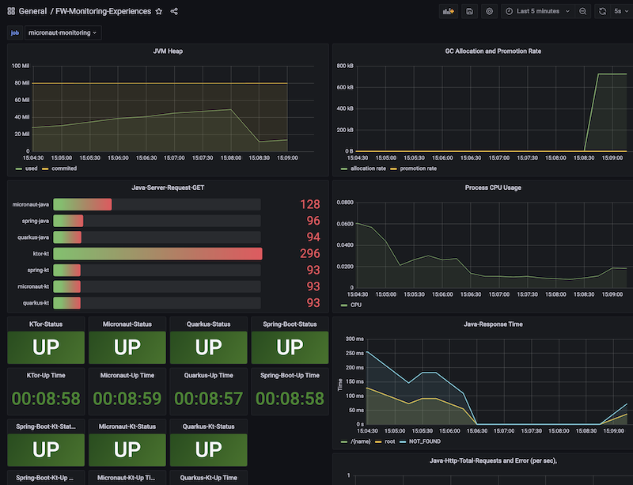

# Framework monitoring examples
### WIP

Welcome to the Framework monitoring example project. The goal of this project 
is to provide insights to using monitoring and alerting on various 
JVM frameworks.

### Requirements
- Gradle 7.4+
- OpenJDK 17+ 
- Grafana 
- Prometheus

Note: update your gradle wrapper!!!

### Frameworks
- KTor, Koin
- Micronaut
- Spring-Boot
- Quarkus

# How to prepare
execute the following commands
1. appropriate docker images should be downloaded
2. Building Framework Images: `$ buildMonitoringContainers.sh`
3. Run a docker-compose file
4. Folder "monitoring" contains a Grafana dashboard files

# How to access Prometheus and Grafana
1. Promeheus `http:\\localhost:3500`
2. Grafana `http:\\localhost:3000`

